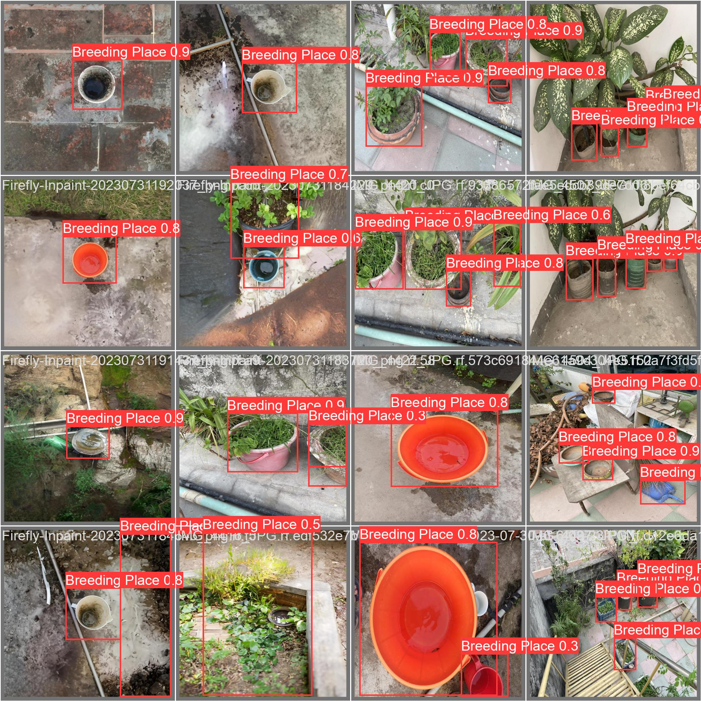

# MosquitoFusion: A Multiclass Dataset for Detection of Mosquitoes, Swarms, and Breeding Sites using Deep Learning

<!DOCTYPE html>
<html lang="en">
<head>
    <meta charset="UTF-8">
    <meta http-equiv="X-UA-Compatible" content="IE=edge">
    <meta name="viewport" content="width=device-width, initial-scale=1.0">
</head>
<body>

<h2>Dataset Overview</h2>

The dataset, comprising 1204 meticulously curated images, serves as a comprehensive resource for advancing real-time mosquito detection models. The dataset is strategically divided into training, validation, and test sets, accounting for 87%, 8%, and 5% of the images, respectively. A rigorous preprocessing phase involves auto-orientation and resizing to standardize dimensions at 640x640 pixels. To ensure dataset integrity, the filter null criterion mandates that all images must contain annotations. Augmentations, including flips, rotations, crops, and grayscale applications, enhance the dataset's diversity, fostering robust model training. With a focus on quality and variety, this dataset provides a solid foundation for evaluating and enhancing real-time Mosquitoes, Swarms, and Breading Sites detection models.

Paper - https://arxiv.org/abs/2404.01501

<h2>Access the Dataset</h2>

Explore the MosquitoFusion dataset on Kaggle: <a href="https://www.kaggle.com/datasets/faiyazabdullah/mosquitofusion-dataset" target="_blank">MosquitoFusion</a>

<h2>Code</h2>

Here is a notebook called 'MosquitoFusion_YOLOv8.ipynb' is used to train the model 'YOLOv8s' for mosquito detection with the MosquitoFusion .

<h2>License</h2>

This dataset is available under <a href="LICENSE">LICENSE</a>. Please review the license before using the dataset for your projects.

<h2>Cite</h2>

If you use MosquitoFusion dataset for your research, please cite it as follows:

<pre>
@inproceedings{
sayeedi2024mosquitofusion,
title={MosquitoFusion: A Multiclass Dataset for Real-Time Detection of Mosquitoes, Swarms, and Breeding Sites Using Deep Learning},
author={Md. Faiyaz Abdullah Sayeedi and Fahim Hafiz and Md Ashiqur Rahman},
booktitle={The Second Tiny Papers Track at ICLR 2024},
year={2024},
url={https://openreview.net/forum?id=3s4hFx8pYs}
}
</pre>

<h2>Contact</h2>

For inquiries or feedback, feel free to contact us at msayeedi212049@bscse.uiu.ac.bd

</body>
</html>
